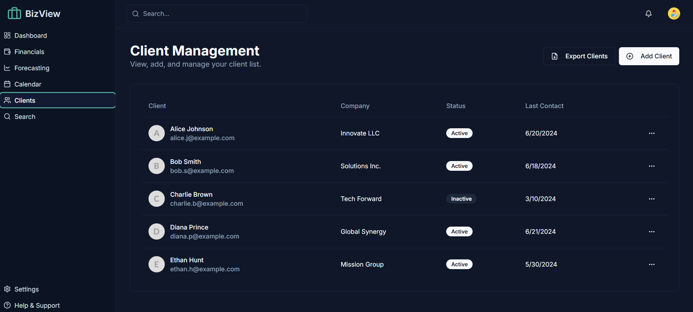
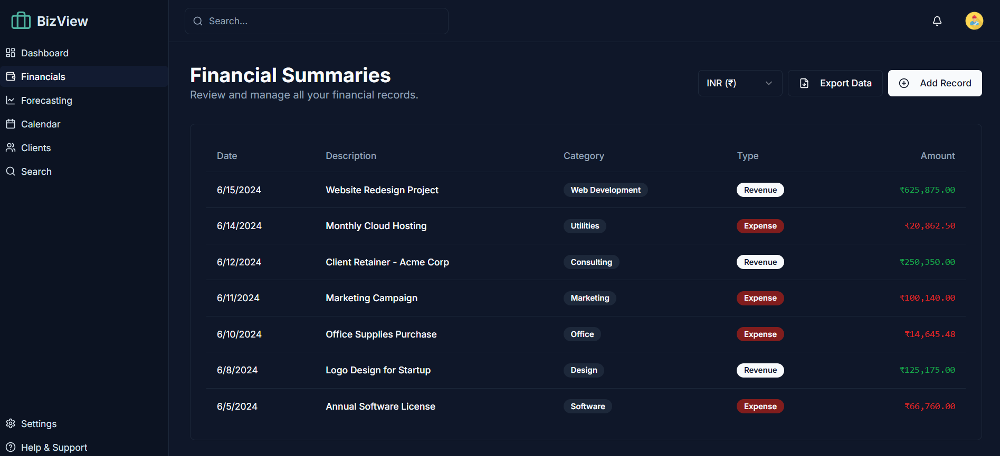

# BizView - AI-Powered Business Management Dashboard

BizView is a modern, AI-powered business management dashboard built with Next.js, ShadCN, Tailwind CSS, and Genkit. It provides a comprehensive suite of tools for managing clients, financials, and appointments, with role-based access control to ensure data security.

## Screenshots

| Dashboard | Client Management |
| :---: | :---: |
| ([./screenshots/dashboard.png]) |  |
| **Financials Page** | **Appointment Calendar** |
|  |  |

## Core Features

- **Secure Authentication**: Robust login system with role-based access control (Admin, Manager, Accountant).
- **Dynamic Dashboard**: A real-time overview of key business metrics, including total revenue, expenses, net profit, and active clients.
- **Client Management**: A centralized hub to add, view, edit, and manage all client information. Only Admins can modify client data.
- **Financial Tracking**: Log and categorize financial records (revenue and expenses) with multi-currency support (USD, EUR, INR).
- **AI Financial Forecasting**: Leverage Genkit to generate future financial projections based on historical data.
- **Appointment Calendar**: A sleek calendar to schedule and manage appointments. Managers and Admins can create and edit events.
- **Profile Management**: Admins can manage user profiles, including names, titles, and avatars for all roles.
- **Global Search**: Instantly find clients or financial records from anywhere in the application.
- **Settings & Theming**: Admins can configure application settings, including a dark/light mode theme switcher.

## Tech Stack

- **Framework**: [Next.js](https://nextjs.org/) (with App Router)
- **UI Components**: [ShadCN UI](https://ui.shadcn.com/)
- **Styling**: [Tailwind CSS](https://tailwindcss.com/)
- **AI/Generative AI**: [Genkit](https://firebase.google.com/docs/genkit)
- **Language**: [TypeScript](https://www.typescriptlang.org/)
- **Linting & Formatting**: ESLint & Prettier

## Getting Started

To get a local copy up and running, follow these simple steps.

### Prerequisites

You will need Node.js and npm installed on your machine.
- [Node.js](https://nodejs.org/) (v18 or higher recommended)

### Installation

1. **Clone the repository:**
   ```sh
   git clone https://github.com/<YOUR_GITHUB_USERNAME>/BizView.git
   cd BizView
   ```

2. **Install NPM packages:**
   ```sh
   npm install
   ```

3. **Set up environment variables:**
   Create a `.env.local` file in the root of your project and add your Genkit/Google AI API keys if necessary.
   ```
   # Example for Google AI with Genkit
   GEMINI_API_KEY=YOUR_API_KEY_HERE
   ```

4. **Run the development server:**
   ```sh
   npm run dev
   ```
   Open [http://localhost:9002](http://localhost:9002) with your browser to see the result.

## Roles & Permissions

The application simulates three different user roles with distinct permissions:

- **Admin**: Has full create, read, update, and delete (CRUD) access across the entire application.
- **Manager**: Can view all data and manage the appointment calendar.
- **Accountant**: Has read-only access limited to the financials page.

You can switch between these roles on the login page to experience the different levels of access.
